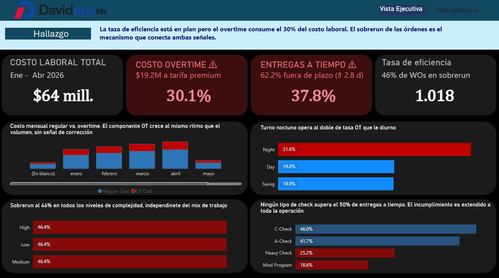
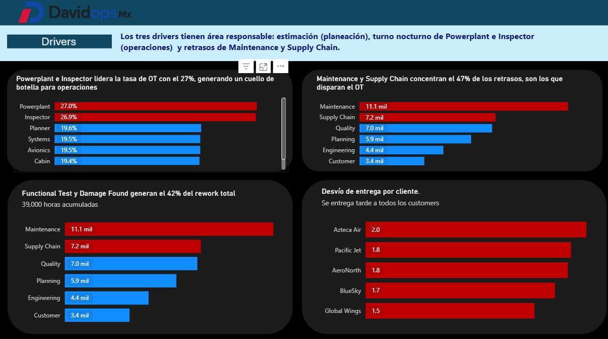

# Aircraft-Maintenance-Analytics-Case-Study

> Proyecto integral de Analítica de Datos orientado a identificar los impulsores operativos del incremento en los costos laborales dentro de una organización de Mantenimiento, Reparación y Overhaul (MRO).

---

#  Descripción del proyecto

Este proyecto desarrolla un análisis de datos de principio a fin sobre la operación de una empresa de mantenimiento aeronáutico.

El caso de negocio parte de una aparente contradicción:

> Los costos laborales aumentan de forma sostenida mientras que los indicadores tradicionales de productividad parecen mantenerse estables.

El objetivo no fue únicamente construir un dashboard, sino comprender qué estaba ocurriendo dentro de la operación, identificar los verdaderos impulsores del incremento en costos y generar recomendaciones accionables para la dirección.

Para ello se desarrolló un flujo completo de trabajo que incluye:

- Comprensión del problema de negocio
- Limpieza y preparación de datos
- Modelado de la información
- Análisis Exploratorio de Datos (EDA)
- Identificación de causas raíz
- Desarrollo de dashboard ejecutivo en Power BI
- Elaboración de recomendaciones estratégicas

---

# Problema de negocio

La dirección de la empresa identificó un incremento constante en el costo laboral durante los primeros meses del año.

Aunque algunos indicadores operativos sugerían una mejora en productividad, el comportamiento financiero mostraba una tendencia opuesta.

El análisis busca responder cinco preguntas clave:

1. ¿Qué está impulsando el incremento en los costos laborales?
2. ¿La productividad realmente está mejorando?
3. ¿Qué factores operativos o estructurales están contribuyendo?
4. ¿Qué relación existe entre costo, productividad y calidad?
5. ¿Qué acciones debe tomar la dirección?

---

# Modelo de datos

El modelo representa la operación típica de una empresa de mantenimiento aeronáutico (MRO).

Las entidades principales son:

- Aircraft_Visits
- Work_Orders
- Labor_Transactions
- Quality_Findings
- Delay_Events

Además se incorporan tablas de referencia para enriquecer el análisis:

- Station_Reference
- Task_Reference
- Skill_Rate_Reference

La narrativa del modelo sigue el flujo operativo de una visita de mantenimiento:

```text
Aircraft Visit
      │
      ▼
 Work Orders
   ├──────────────┐
   ▼              ▼
Labor        Quality
   │
   ▼
Delays
```

---

# Flujo del proyecto

El proyecto sigue un proceso completo de analítica de datos.

```text
Datos originales (CSV)
          │
          ▼
Limpieza y preparación
          │
          ▼
Validación de calidad
          │
          ▼
Transformación y enriquecimiento
          │
          ▼
Análisis Exploratorio (EDA)
          │
          ▼
Obtención de hallazgos
          │
          ▼
Dashboard Ejecutivo
          │
          ▼
Presentación de recomendaciones
```

---

# Análisis Exploratorio de Datos (EDA)

El análisis se desarrolló sobre cuatro dimensiones principales.

## Costos laborales

Se analizaron indicadores como:

- Costo laboral total
- Horas extra (Overtime)
- Distribución por estación
- Distribución por turno
- Distribución por especialidad
- Evolución mensual

---

## Productividad

Se evaluó:

- Efficiency Ratio
- Horas planeadas vs horas reales
- Productividad por complejidad
- Productividad por estación
- Tendencias mensuales

---

## Calidad

Se analizaron:

- Horas de retrabajo
- Costo del retrabajo
- Distribución de hallazgos
- Rework Rate
- Principales categorías de defectos

---

## Retrasos operativos

Se estudiaron:

- Órdenes retrasadas
- Horas de retraso
- Causas de retraso
- Departamentos involucrados
- Cumplimiento de tiempos comprometidos

---

# Principales hallazgos

El análisis permitió identificar que el incremento del costo laboral no está relacionado con una mayor carga de trabajo, sino con ineficiencias estructurales de la operación.

## Horas extra

- El 30% del costo laboral corresponde a horas extra.
- El turno nocturno registra un ratio de overtime considerablemente mayor que el turno diurno.
- La especialidad Powerplant presenta la mayor dependencia de horas extra.

---

## Planeación

- El 46% de las órdenes exceden las horas originalmente planeadas.
- Este comportamiento ocurre de forma consistente independientemente de la complejidad del trabajo.

---

## Productividad

- El Efficiency Ratio global es de **1.02**, prácticamente alineado con el objetivo.
- No se observa una mejora significativa de productividad durante el periodo analizado.

---

## Calidad

- Se identificaron **47,733 horas de retrabajo**.
- El costo estimado asociado al retrabajo supera los **2.5 millones de dólares**.

---

## Retrasos

- El 62% de las visitas finalizan fuera del plazo comprometido.
- Maintenance y Supply Chain concentran casi la mitad de las horas de retraso.

---

# Conclusión principal

La evidencia muestra que el crecimiento del costo laboral **no está siendo impulsado por un incremento en la demanda ni por una mejora en productividad**.

Los principales impulsores identificados son:

- Dependencia estructural de horas extra.
- Planeación inexacta de las órdenes de trabajo.
- Cuellos de botella en especialidades críticas.
- Retrabajo derivado de problemas de calidad.
- Retrasos ocasionados por fricciones operativas.

---

# Dashboard Ejecutivo

Como resultado del análisis se desarrolló un dashboard interactivo en Power BI orientado a la toma de decisiones.

El dashboard permite monitorear:

- Costos laborales
- Productividad
- Calidad
- Retrasos operativos

Incluye:

- Indicadores ejecutivos (KPIs)
- Tendencias temporales
- Comparativos entre estaciones
- Análisis por especialidad
- Segmentación dinámica
- Visualización de causas principales







---


# Estructura del repositorio

```text
.
├── data/
│   └── cleaned/
│
├── notebooks/
│   ├── 02_limpieza_preparacion.ipynb
│   └── 04_eda.ipynb
│
├── dashboard/
│   └── dashboard.pbix
│
├── presentacion/
│   └── Presentacion_Ejecutiva.pdf
│
├── images/
│
└── README.md
```

---

# Recomendaciones estratégicas

Con base en los resultados obtenidos, las principales líneas de acción para la dirección son:

- Reducir la dependencia de horas extra mediante una mejor planificación de capacidad.
- Rebalancear la dotación entre turnos y especialidades críticas.
- Actualizar los estándares de estimación de horas por orden de trabajo.
- Disminuir el retrabajo mediante acciones preventivas de calidad.
- Fortalecer la coordinación entre Maintenance y Supply Chain.
- Incorporar indicadores operativos que permitan monitorear los impulsores del costo y no únicamente los resultados financieros.
